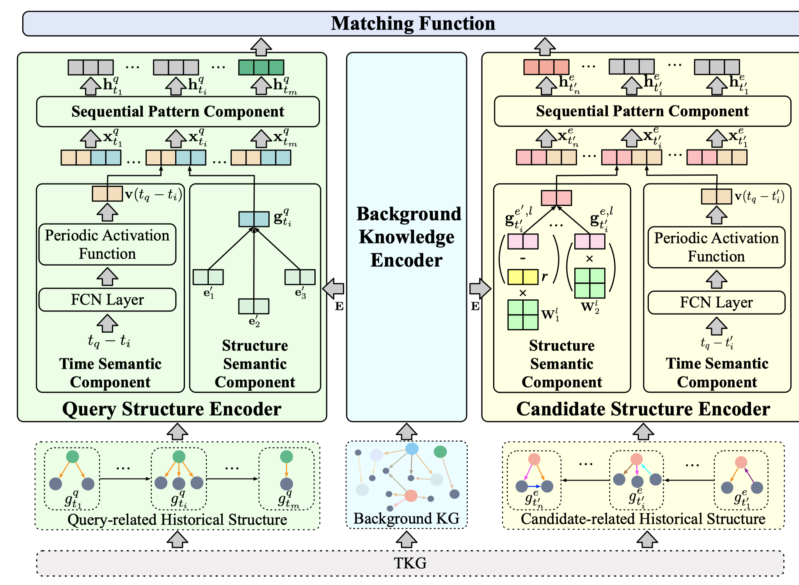

# HiSMatch: Historical Structure Matching based Temporal Knowledge Graph Reasoning

This is the official code release of the following paper: 

Zixuan Li, Zhongni Hou, Saiping Guan, Xiaolong Jin, Weihua Peng, Long Bai, Yajuan Lyu , Wei Li, Jiafeng Guo, Xueqi Cheng. [HiSMatch: Historical Structure Matching based Temporal Knowledge Graph Reasoning](https://aclanthology.org/2022.findings-emnlp.542.pdf). EMNLP 2022 Findings.



## Quick Start

### Environment variables & dependencies
```
conda create -n hismatch python=3.7

conda activate hismatch

pip install -r requirement.txt
```
### Download and Process data
Some dataset files can be found in the project of our SIGIR 2021 paper "Temporal Knowledge Graph Reasoning Based on Evolutional Representation Learning"[(RE-GCN)](https://github.com/Lee-zix/RE-GCN/blob/master/data-release.tar.gz).

First, unzip and unpack the data files,
```
tar -zxvf data-release.tar.gz
```

### Before your training, please preprocess the dataset to generate the query-related historical structures and candidate-related historical structures.

1. Generate the query-related historical structures.

```
cd hismatch_preprocess
python get_repetitive_history.py -d ICEWS14s -his 5
```

2. The canditate-related historical structures are stored in the dict with (e, t) with key and structure as value.

```
cd hismatch_preprocess
python get_history_dict.py -d ICEWS14s -his 5 -start-time 1 -gap 1
```

The start time and the time gap value of the dataset are different for different datasets. So open the train.txt to make sure that the start timesatmp of the dataset and the gap between the adajacent timestamp are right. 

### The following is used for model training and test, which can be ignored when run the demo code


1.  Using the following commond to train the model.

```
cd src
python main.py -d ICEWS14s --n-hidden 128 --self-loop --background-len 4 --encoder uvrgcn-sub --bg-encoder uvrgcn-sub --start-time 1 --time-gap 1 --history-len 5 --gpu 2 --test 0
```
2.  Using the following commond to test the model.

```
python main.py -d ICEWS14s --n-hidden 128 --self-loop --background-len 4 --encoder uvrgcn-sub --bg-encoder uvrgcn-sub --start-time 1 --time-gap 1 --history-len 5 --gpu 2 --test 1
```

### Change the hyperparameters
To get the optimal result reported in the paper, change the hyperparameters and other experiment set up according to Section 5.1.4 in the paper (https://aclanthology.org/2022.findings-emnlp.542.pdf). 

## Citation
If you find the resource in this repository helpful, please cite
```
@inproceedings{li-etal-2022-hismatch,
    title = "{H}i{SM}atch: Historical Structure Matching based Temporal Knowledge Graph Reasoning",
    author = "Li, Zixuan  and
      Hou, Zhongni  and
      Guan, Saiping  and
      Jin, Xiaolong  and
      Peng, Weihua  and
      Bai, Long  and
      Lyu, Yajuan  and
      Li, Wei  and
      Guo, Jiafeng  and
      Cheng, Xueqi",
    booktitle = "Findings of the Association for Computational Linguistics: EMNLP 2022",
    month = dec,
    year = "2022",
    address = "Abu Dhabi, United Arab Emirates",
    publisher = "Association for Computational Linguistics",
    url = "https://aclanthology.org/2022.findings-emnlp.542",
    pages = "7328--7338",
    abstract = "A Temporal Knowledge Graph (TKG) is a sequence of KGs with respective timestamps, which adopts quadruples in the form of (\textit{subject}, \textit{relation}, \textit{object}, \textit{timestamp}) to describe dynamic facts. TKG reasoning has facilitated many real-world applications via answering such queries as (\textit{query entity}, \textit{query relation}, \textit{?}, \textit{future timestamp}) about future. This is actually a matching task between a query and candidate entities based on their historical structures, which reflect behavioral trends of the entities at different timestamps. In addition, recent KGs provide background knowledge of all the entities, which is also helpful for the matching. Thus, in this paper, we propose the \textbf{Hi}storical \textbf{S}tructure \textbf{Match}ing (\textbf{HiSMatch}) model. It applies two structure encoders to capture the semantic information contained in the historical structures of the query and candidate entities. Besides, it adopts another encoder to integrate the background knowledge into the model. TKG reasoning experiments on six benchmark datasets demonstrate the significant improvement of the proposed HiSMatch model, with up to 5.6{\%} performance improvement in MRR, compared to the state-of-the-art baselines.",
}

```
